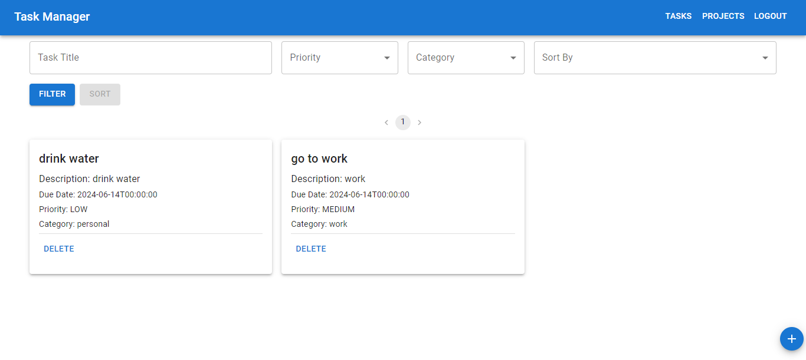
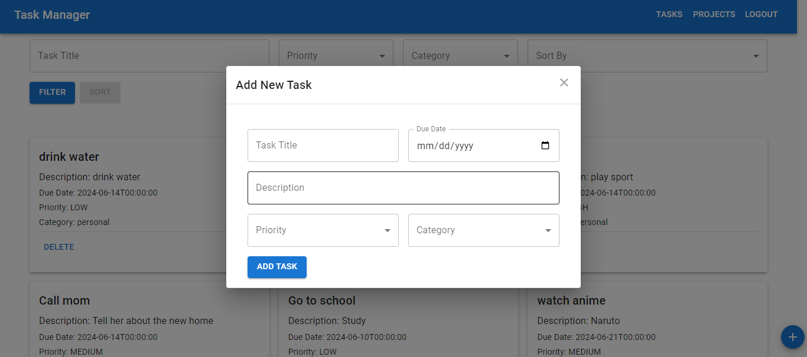
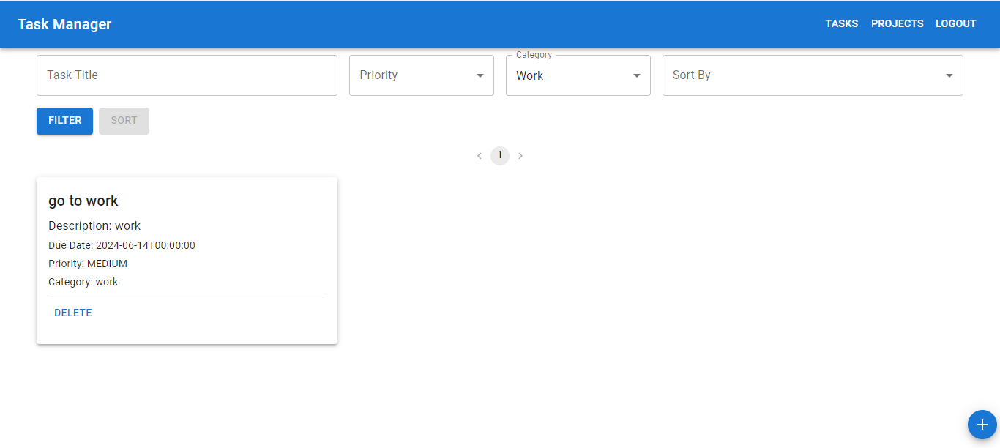
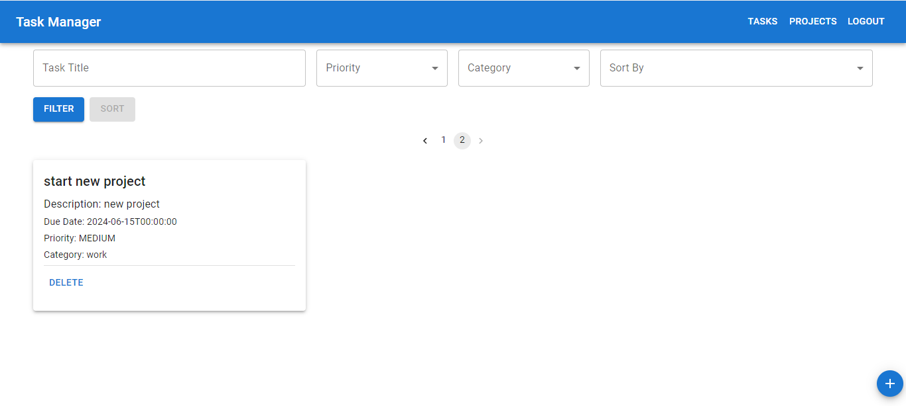
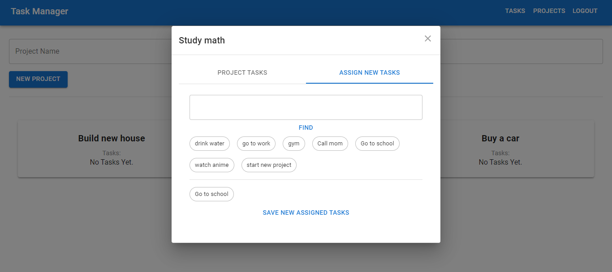
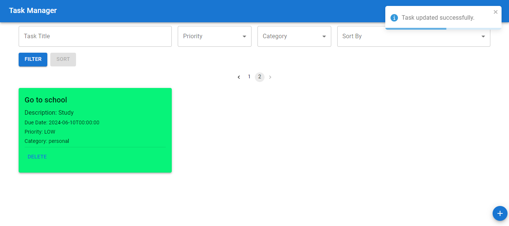
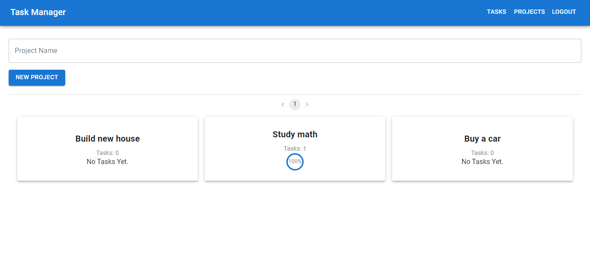
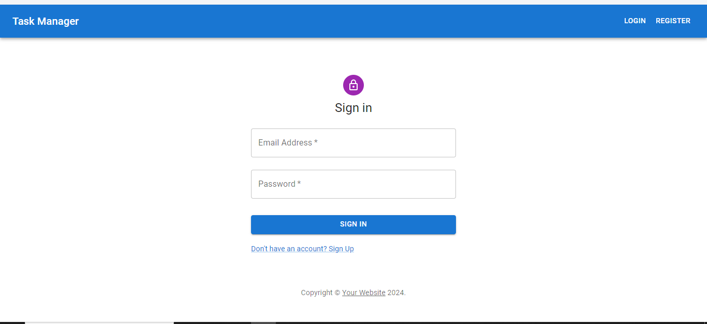

# TASK Manager

TASK Manager is a powerful tool that simplifies the process of organizing and managing your tasks.

## Table of Contents

- [Stack](#stack)
- [Installation](#installation)
- [Usage](#usage)
- [Screenshots](#screenshots)
- [Features](#features)
- [Documentation](#documentation)
- [Contact](#contact)

## Stack

1. Spring Boot , Security, JWT, OPEN_API
2. Postgresql
3. React, redux, MUI along with TypeScript
4. Azure VM for deploy
5. GitHub actions for automating the app build.

## Installation

1. Clone the repository: `git clone https://github.com/emadhashem/Task-Manager-Spring-React-.git`.
2. Navigate to the project directory: `cd <name>`.
3. Install dependencies for front-end: `yarn install`.
4. Run it with docker: `docker compose up`.

## Usage

1. Run the application: `docker compose up`.
2. Open your web browser and navigate to `http://localhost:5173`.
3. Sign up for a new account or log in with your existing credentials.
4. Explore the intuitive user interface and start managing your tasks effortlessly.

## Screenshots

    Here are some screenshots of Task Manager in action:

*List All Tasks*

*Creating new task*

*Filter By Category*

*Using Pagination*

*Assign tasks to Project*

*Complete Task*

*Projects list*

*See how many tasks are done in project*

*Authentication*

## Features

- Task creation, editing, and deletion
- Task prioritization and categorization
- Task filter by name, priority and category
- Task Sort by name, priority and category (Future TODO List )
- Due date reminders and notifications (Future TODO List )
- Collaborative task management with team members
- Mobile-responsive design for on-the-go access
- Using docker compose to containerize the whole app
- Deploy it on Azure-VM

## Live Demo

For Live demo Check [LIVE DEMO](http://4.221.72.146:5173/).

## License

AwesomeApp is licensed under the [MIT License](./LICENSE).

## Documentation

For detailed API documentation and additional resources, please refer to
our [official documentation](http://4.221.72.146:8088/api/v1/swagger-ui.html).

## Contact

For any questions, feedback, or support, feel free to contact us at `emadobito22@gmail.com`. You can also find us
on [LinkedIn](https://www.linkedin.com/in/emad-hashem-0967961a7/).